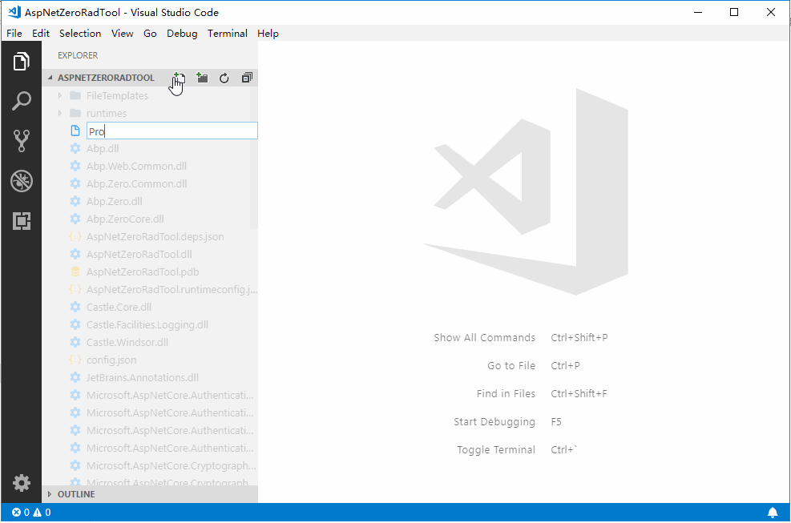

# Asp.Net One rad tool for vscode 

## Description

aspnet one rad tool is a VS Code extension which lets you create an entity and its corresponding layers from the database to the user interface. So, you can create a fully working, production ready CRUD page in seconds.

It is similar with the official visual studio extension: [ASP.NET One Power Tools](https://marketplace.visualstudio.com/items?itemName=Volosoft.AspNetOnePowerTools)

## Usage

1. new a YourEntity.json file in the `aspnet-core\AspNetOneRadTool` folder
2. using code snippets to edit YourEntity.json file
3. run the command `Run ASP.NET One Rad Tool` from explore context menu

## Available Snippets

* one-entity
* one-property
* one-nav-property
* one-enum-def

## Fields of entity json

please refs aspnet one document [https://docs.aspnetone.com/documents/one/latest/Development-Guide-Rad-Tool-Mac-Linux](https://docs.aspnetone.com/documents/one/latest/Development-Guide-Rad-Tool-Mac-Linux)

**Enjoy!**
